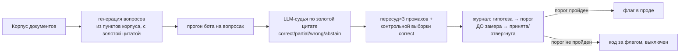
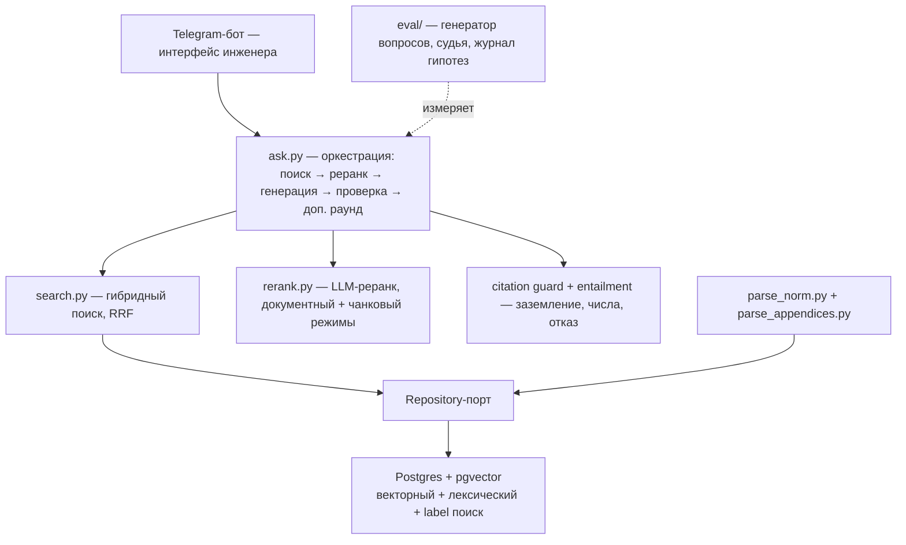

# Архитектура RAG-ассистента по нормативной базе

## Поток данных

```mermaid
flowchart LR
    subgraph corpus[Корпус]
        PDF[PDF: СП / СН / ГОСТ / EN]
    end

    PDF --> PARSE[universal parser<br/>раздел → пункт, профиль на документ]
    PARSE --> APPX[appendix parser<br/>таблицы pdfplumber + проза]
    APPX --> COV{coverage ≥ порога?}
    COV -->|нет| QUAR[карантин: доработка парсера]
    COV -->|да| IDX[index<br/>эмбеддинги + BM25 → Postgres/pgvector]

    Q[Вопрос инженера] --> SEARCH[hybrid search<br/>vector + BM25 + label RRF]
    IDX --> SEARCH
    SEARCH --> RERANK[LLM-реранк<br/>Haiku-тир, precision]
    RERANK --> SIB[+ соседние пункты<br/>+ парный СН/СП]
    SIB --> GEN[generate<br/>ответ с тегами [И1]…[Иn]]
    GEN --> GUARD{citation guard<br/>+ entailment}
    GUARD -->|тег вне диапазона<br/>или число не из источника| RETRY[доп. раунд поиска<br/>или отказ]
    GUARD -->|ок| OUT[Ответ + ссылки<br/>факт → документ → пункт → стр.]
```

## Контур эвала (отдельный, управляет тем, что вообще меняется в проде)



## Слои



## Ключевые архитектурные принципы

**Заземление через теги, а не через номер пункта.** В корпусе из сотен документов номер
«5.2» есть почти everywhere — сверка по номеру глобально бессмысленна. Каждый найденный
фрагмент получает тег `[Иn]`; модель ссылается только тегами; код проверяет, что тег
существует. «Выдумать» источник технически невозможно — это не промпт-инструкция, а
инвариант формата ответа.

**Числа проверяются отдельно от заземления.** Тег может существовать, но число внутри
абзаца — быть подменено (галлюцинация не в ссылке, а в содержании). Слой entailment
сверяет величины из утверждения с текстом процитированного источника детерминированно,
приводя единицы к общему виду; при недоступности семантической LLM-проверки числовая
сверка продолжает работать (fail-open гасит только часть вердикта, не весь).

**Гипотезы генерации и поиска меряются раздельно, порог — до замера.** Улучшение метрики
поиска («пункт выше в выдаче») не гарантирует улучшение ответа: реранкер получает весь пул
целиком и может взять правильный пункт независимо от его места в списке. Несколько гипотез
(мягкий подъём по схожести документа, укорачивание контекста реранкера, лексический поиск
по переформулировкам, цитата в начале ответа) улучшали промежуточные метрики поиска, но не
переносились в качество ответа на эвале — и остались за выключенным флагом, а не в проде.
Правило приёмки формулируется до прогона, а не после того, как видны цифры.

**Парсер — один движок с профилем на документ, а не документ-специфичный код.**
Грамматика «раздел → пункт» отличается между документами (нумерация, приложения,
двуязычные шапки), но переиспользуемых паттернов больше, чем уникальных — отсюда один
парсер с декларативным профилем на документ, а не отдельный скрипт на каждый.

**Coverage как метрика приёмки разбора, а не факт «документ разобран».** Знаменатель —
весь документ, включая приложения; ниже порога документ уходит в карантин на доработку
парсера, а не заливается в корпус с дырой в нормативном тексте.
